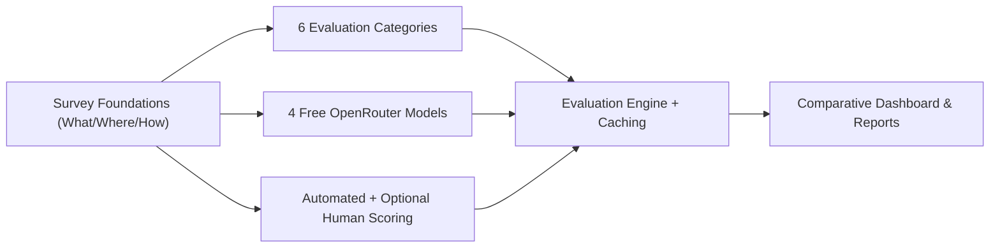
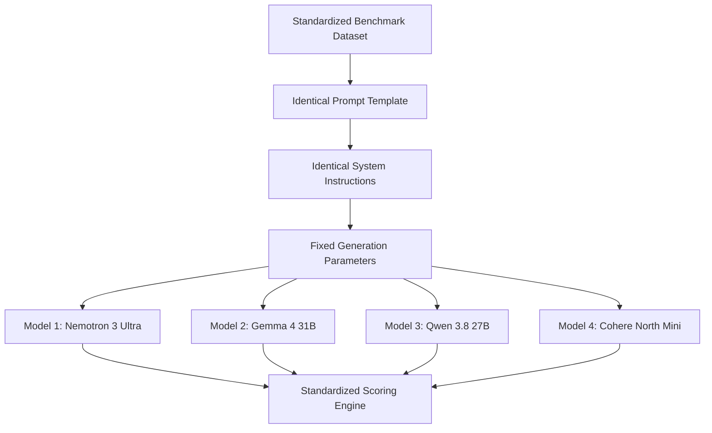
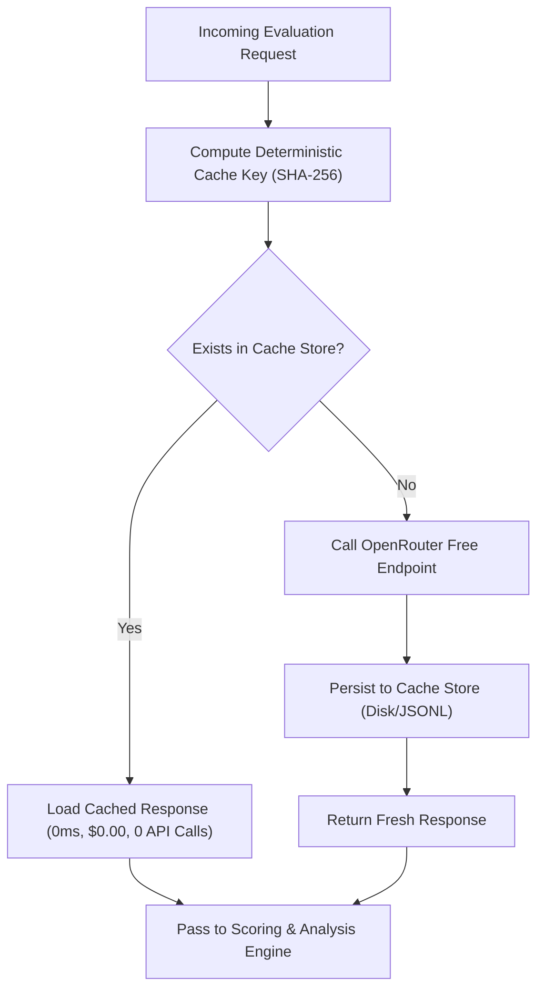
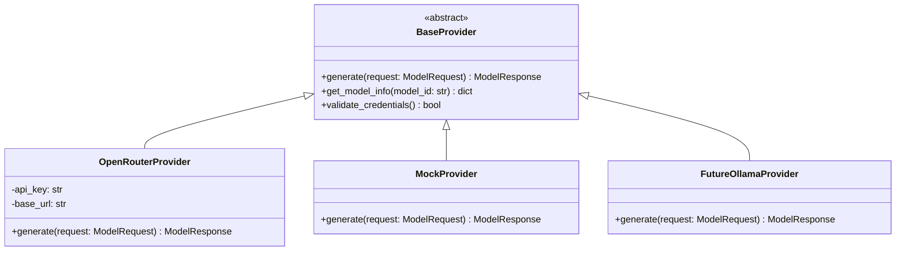
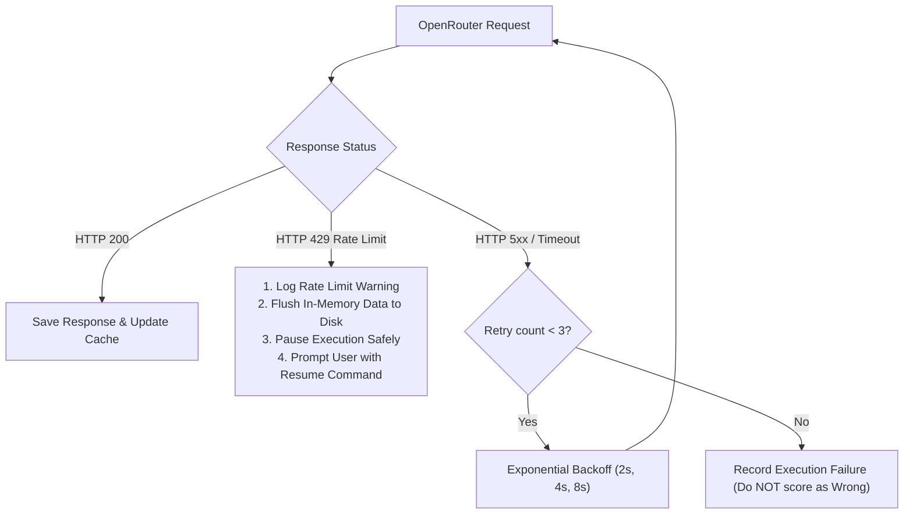
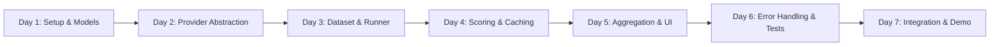

# Plan: Building the Zero-Cost LLM Evaluation Platform

> **Project Title:** Evaluating Large Language Models — Accuracy, Robustness, and Response Reliability
>
> **Research Question:** How do model performance, capability profiles, and rankings compare across diverse tasks when evaluated under identical, standardized conditions on zero-cost endpoints?
>
> **Primary Reference:** *A Survey on Evaluation of Large Language Models* (Chang et al., 2024) — [`sources/ai_project.md`](file:///C:/Users/lenovo/evaluating-llms/sources/ai_project.md)

---

## Table of Contents

1. [Project Summary & Core Philosophy](#1-project-summary--core-philosophy)
2. [Zero-Cost & Free-Tier Operational Rules](#2-zero-cost--free-tier-operational-rules)
3. [Verified Four-Model Selection](#3-verified-four-model-selection)
4. [Fair Model Comparison Framework](#4-fair-model-comparison-framework)
5. [Evaluation Categories & Task Taxonomy](#5-evaluation-categories--task-taxonomy)
6. [Request Budget & Free-Tier Optimization](#6-request-budget--free-tier-optimization)
7. [Response Caching Architecture](#7-response-caching-architecture)
8. [Evaluation Metrics & Scoring Engine](#8-evaluation-metrics--scoring-engine)
9. [Evaluation Approaches (Automated vs Human vs LLM)](#9-evaluation-approaches)
10. [Human Review & Optional Second Reviewer Protocol](#10-human-review--optional-second-reviewer-protocol)
11. [Provider Abstraction Architecture](#11-provider-abstraction-architecture)
12. [End-to-End Evaluation Workflow](#12-end-to-end-evaluation-workflow)
13. [Robustness & Perturbation Analysis](#13-robustness--perturbation-analysis)
14. [Reproducibility & Raw Response Storage](#14-reproducibility--raw-response-storage)
15. [Error Handling & Rate-Limit Resilience](#15-error-handling--rate-limit-resilience)
16. [Results Comparison & Dashboard Design](#16-results-comparison--dashboard-design)
17. [Environment Variables & Security](#17-environment-variables--security)
18. [Seven-Day Implementation Schedule](#18-seven-day-implementation-scope)
19. [Testing Strategy](#19-testing-strategy)
20. [Project File Layout](#20-project-file-layout)
21. [Verification Gates & Quality Checkpoints](#21-verification-gates--quality-checkpoints)
22. [Risk Register & Mitigations](#22-risk-register--mitigations)
23. [Non-Goals for the Initial MVP](#23-non-goals-for-the-initial-mvp)
24. [Future Extensibility Roadmap](#24-future-extensibility-roadmap)
25. [Definition of Done](#25-definition-of-done)
26. [References](#26-references)

---

## 1. Project Summary & Core Philosophy

We are building a lightweight, extensible, and completely **zero-cost LLM evaluation platform** that:

- Simultaneously evaluates **FOUR fixed, verified free-tier models** from distinct architectural families via OpenRouter.
- Assesses performance across **six core task categories**: General Reasoning, Mathematics, Coding, Knowledge, Summarization, and Instruction Following.
- Implements strict **fair comparison protocols** where every model receives identical prompts, instructions, parameters, and scoring rules.
- Incorporates an intelligent **response caching mechanism** and **incremental execution runner** to guarantee operation within OpenRouter's legitimate free-tier rate limits.
- Separates evaluation into **objective automated metrics**, **optional single/double human review**, and **optional zero-cost LLM judging**.
- Provides a clean **Streamlit comparison dashboard** with drill-down to individual raw responses, latency, token counts, and scoring breakdowns.
- Guarantees **100% reproducibility** by preserving immutable experiment configurations, raw provider outputs, and dataset fingerprints.



---

## 2. Zero-Cost & Free-Tier Operational Rules

The initial implementation of this platform is designed strictly for **zero monetary cost**. No paid API tokens, credits, or subscriptions are required.

### 2.1 Free-Tier Constraints & Boundaries
* **Provider:** OpenRouter free model endpoints (distinguished by the `:free` suffix).
* **Rate Limits:** OpenRouter free tier enforces standard limits:
  - **20 Requests Per Minute (RPM)**
  - **50 Requests Per Day (RPD)** for standard free accounts (up to 1,000 RPD for accounts with historical usage).
* **Cost Accounting:** All API requests on selected endpoints are recorded as **$0.00**, while token counts are preserved for future cost modeling.

### 2.2 Strict Ethical & Compliance Policy
> [!IMPORTANT]
> **NO Rate-Limit Bypassing or Circumvention:**
> - NEVER use multiple accounts, account rotation, automated account creation, or fake accounts.
> - NEVER use API-key rotation or distributed IP proxying to evade limits.
> - When a rate limit (HTTP 429) is encountered, the system **MUST pause/stop**, save all progress, and allow resuming later.

### 2.3 Efficiency Through Engineering
Instead of evading limits, the platform achieves full evaluation through smart engineering:
1. **Response Caching:** Every request/response pair is indexed by a deterministic hash. Cached responses are served instantly with zero API calls.
2. **Compact Benchmark Sizing:** Initial evaluation batches are sized to fit well within daily allowances (e.g., 30–48 requests per full pass across 4 models).
3. **Multi-Day Run Partitioning:** The runner natively supports pausing after a quota limit and resuming on subsequent days without re-running completed questions.
4. **Offline Development & Mock Testing:** All unit tests and UI development use local mock adapters or cached data, consuming zero live API quota.

---

## 3. Verified Four-Model Selection

To provide a rigorous, cross-family comparison, the platform evaluates **FOUR fixed models** spanning different architectures, parameter scales, and creators. All four are verified as available on OpenRouter's free tier.

| # | Model Name | Creator / Family | Exact OpenRouter Model ID | Context Window | Architecture / Focus |
|---|---|---|---|---|---|
| 1 | **NVIDIA Nemotron 3 Ultra** | NVIDIA | `nvidia/nemotron-3-ultra:free` | 1,000,000 | Ultra-large scale general reasoning & alignment |
| 2 | **Google Gemma 4 31B** | Google | `google/gemma-4-31b-it:free` | 128,000 | Dense open-weight instruction-tuned model |
| 3 | **Qwen 3.8 27B** | Alibaba Qwen | `qwen/qwen3.8-27b:free` | 32,768 | Multilingual, math & logical reasoning |
| 4 | **Cohere North Mini Code** | Cohere | `cohere/north-mini-code:free` | 32,768 | Code-specialized reasoning & generation |

### 3.1 Model Selection Rationale
- **Cross-Family Diversity:** Covers NVIDIA (Nemotron), Google (Gemma), Alibaba (Qwen), and Cohere (Command/North), avoiding single-vendor bias.
- **Task Specialization:** Includes both general-purpose instruction models (Gemma, Qwen, Nemotron) and a dedicated coding model (Cohere North Mini Code) to reveal capability trade-offs.
- **Fixed Model Identity Rule:** We strictly **DO NOT use `openrouter/free`**. The generic free router dynamically routes prompts to arbitrary models, destroying experimental control and reproducibility. Fixed IDs guarantee identical model weights across all evaluation runs.

### 3.2 Dynamic Fallback & Replacement Policy
If any model endpoint is temporarily unavailable or deprecated by OpenRouter:
1. The system logs the exact reason and timestamp.
2. The user is prompted to select the closest available free equivalent (e.g., `google/gemma-4-26b-a4b-it:free` or `meta-llama/llama-3.3-70b-instruct:free`).
3. The substitution is explicitly recorded in `runs/<experiment_id>/config.json` and highlighted in all generated reports.

---

## 4. Fair Model Comparison Framework

Scientific validity requires that differences in scores reflect true model capability differences rather than prompt variations or configuration drift.



### 4.1 Parameter Alignment Matrix

| Parameter | Standard Value | Reason / Enforcement | Provider Differences Handling |
|---|---|---|---|
| **Test Questions** | Identical set across all 4 models | Zero dataset skew; all models answer question $Q_i$ | Strictly enforced by runner loop |
| **System Instruction** | Fixed standard system prompt | Controls baseline conversational role | Applied uniformly across all requests |
| **Prompt Template** | `Question: {prompt}\nAnswer:` | Eliminates formatting bias | Shared formatting function |
| **Temperature** | `0.0` (where supported) | Minimizes sampling noise; promotes reproducibility | Recorded in response metadata |
| **Max Output Tokens** | `512` (or `1024` for code) | Prevents premature truncation across models | Shared config per category |
| **Top-P / Top-K** | Default / `1.0` | Eliminates disparate nucleus sampling | Uniformly passed if supported |

### 4.2 Prevention of Asymmetric Evaluation
- **No Question Count Imbalance:** A run cannot evaluate 20 questions on Model A and 30 on Model B. If a run is interrupted, analysis is performed only on the intersection of successfully evaluated questions across all four models, or uncompleted questions are clearly marked as missing pairs.
- **Independent Failure Accounting:** API timeouts or HTTP errors are recorded as **Execution Failures**, not as incorrect factual answers, preventing artificial degradation of response quality scores.

---

## 5. Evaluation Categories & Task Taxonomy

The benchmark comprises **SIX distinct capability categories** derived from the survey framework ([`sources/ai_project.md`](file:///C:/Users/lenovo/evaluating-llms/sources/ai_project.md)), spanning both objective and generative tasks.

| # | Category | What It Measures | Example Prompt Type | Primary Scoring Method |
|---|---|---|---|---|
| 1 | **General Reasoning** | Multi-step deduction, commonsense logic, relational inference | Logic puzzles, syllogisms, cause-effect deductions | Objective exact-match / MCQ extraction |
| 2 | **Mathematics** | Numerical accuracy, arithmetic, algebraic problem-solving | Word problems, arithmetic operations, percentages | Numeric normalization with tolerance |
| 3 | **Coding** | Code synthesis, syntax correctness, algorithmic logic | Python function implementation, bug fixing | Execution test cases / syntax parsing / rule checks |
| 4 | **Knowledge** | Factual recall, domain accuracy across science/history/arts | Multiple-choice questions, factual single-answer QA | Letter extraction (MCQ) / normalized text match |
| 5 | **Summarization** | Conciseness, salient point extraction, hallucination avoidance | Paragraph/passage summarization under length constraints | Length constraints + keyword coverage + human review |
| 6 | **Instruction Following** | Strict adherence to complex negative/positive constraints | "Output valid JSON with keys [A, B]", "Do not use letter 'e'" | Rule-based deterministic checker (JSON parse, regex) |

### 5.1 Category Scoring Details

#### 1. General Reasoning & Knowledge
- **Format:** Structured Multiple Choice (A/B/C/D) or concise short-answer.
- **Scorer:** `MultipleChoiceScorer` / `ShortAnswerScorer`.
- **Logic:** Extracts selected option via robust regex; compares against ground truth. Detects ambiguous multi-option responses.

#### 2. Mathematics
- **Format:** Word problems with deterministic numerical answers.
- **Scorer:** `NumericScorer`.
- **Logic:** Extracts final number, strips currency/units ("₹", "kg", "%"), handles scientific notation and floating-point tolerances ($\epsilon \le 10^{-4}$).

#### 3. Coding
- **Format:** Self-contained Python function prompts with clear signature specifications.
- **Scorer:** `CodeSyntaxScorer` & `UnitCheckScorer`.
- **Logic:** Checks Python AST syntax validity, validates function existence, and evaluates against 2–3 input/output assertion pairs.

#### 4. Instruction Following
- **Format:** Prompts with explicit, checkable constraints (e.g., "Respond in valid JSON", "Limit to exactly 3 bullet points", "Include forbidden word filter").
- **Scorer:** `InstructionScorer`.
- **Logic:** Computes:
  1. *Per-Constraint Satisfaction Rate:* Fraction of individual constraints passed.
  2. *Full Compliance Rate:* Binary indicator if 100% of constraints were satisfied.

#### 5. Summarization
- **Format:** Passage accompanied by specific length or perspective instructions.
- **Scorer:** `LengthConstraintScorer` + Keyword Recall + Optional Human/LLM Judge.
- **Logic:** Evaluates word count bounds, key entity preservation, and flags hallucinations.

---

## 6. Request Budget & Free-Tier Optimization

To guarantee zero cost and avoid rate-limiting, the initial benchmark is deliberately sized to operate within OpenRouter's free-tier quota (50 requests/day for new accounts; 20 RPM).

### 6.1 Benchmark Sizing Strategy

| Benchmark Tier | Prompts per Category | Total Prompts (6 Cats) | Total Requests (4 Models) | Estimated Run Time | Feasibility on Free Tier |
|---|---:|---:|---:|---|---|
| **Smoke Test (Day 1-2)** | 1 prompt | 6 | 24 requests | ~2 minutes | 1 single run within 1 daily quota |
| **Initial MVP (Day 3-7)** | 2 prompts | 12 | 48 requests | ~5 minutes | 1 single run within 50 daily quota |
| **Expanded Benchmark** | 5 prompts | 30 | 120 requests | ~15 minutes | Partitioned across 3 days (or 1 day on 1000-tier) |
| **Full Robustness Suite** | 5 base + 5 variants | 60 | 240 requests | ~30 minutes | Incremental caching over 5 days |

### 6.2 Execution Scheduling Algorithm
- **Batching:** Requests are sent sequentially or with a controlled concurrency limit ($1 \text{ req/3 sec} = 20 \text{ RPM}$).
- **Rate-Limit Backoff:** If an HTTP 429 response is received, the runner automatically halts further calls for the affected provider, writes all completed responses to disk, and outputs the exact time when quota resets.
- **Zero Waste:** Already evaluated prompts are cached permanently; resuming never re-spends quota.

---

## 7. Response Caching Architecture

Response caching is the cornerstone of the zero-cost architecture. It prevents duplicate requests, enables rapid offline re-scoring, and protects against accidental quota exhaustion.



### 7.1 Cache Key Generation
The cache key is a deterministic SHA-256 hash computed over all execution invariants:

$$\text{Cache Key} = \text{SHA256}(\text{model\_id} \,\|\, \text{prompt} \,\|\, \text{system\_prompt} \,\|\, \text{temperature} \,\|\, \text{max\_tokens} \,\|\, \text{dataset\_version})$$

```python
import hashlib
import json

def generate_cache_key(model_id: str, prompt: str, system_prompt: str,
                       temperature: float, max_tokens: int, dataset_version: str) -> str:
    payload = {
        "model_id": model_id.strip(),
        "prompt": prompt.strip(),
        "system_prompt": system_prompt.strip() if system_prompt else "",
        "temperature": round(temperature, 4),
        "max_tokens": max_tokens,
        "dataset_version": dataset_version.strip()
    }
    serialized = json.dumps(payload, sort_keys=True)
    return hashlib.sha256(serialized.encode("utf-8")).hexdigest()
```

### 7.2 Storage & Invalidation Rules
- **Storage Location:** `runs/cache/response_cache.jsonl` (and mirrored in experiment run folders).
- **Cache Validity:** Cache entries are immutable and perpetual for deterministic settings ($\text{temperature} = 0.0$).
- **Cache Bypass Flag:** A CLI flag `--no-cache` or `--refresh-cache` allows explicit re-evaluation if model endpoints update.

---

## 8. Evaluation Metrics & Scoring Engine

The platform captures both output quality and operational system performance.

### 8.1 Quality Metrics
1. **Accuracy / Correctness:** Binary [0, 1] for exact-match, numeric, and MCQ answers.
2. **Instruction Compliance Rate:** Percentage of negative/positive constraints satisfied.
3. **Code Syntax & Execution Pass Rate:** Binary AST validation and unit test success.
4. **F1 / Token Overlap Score:** Harmonic mean of precision and recall for open-ended answers.
5. **Robustness Delta ($\Delta \text{Acc}$):** Difference in accuracy between original and paraphrased prompts:
   $$\Delta \text{Acc} = \text{Accuracy}_{\text{original}} - \text{Accuracy}_{\text{variant}} \quad (\text{in percentage points})$$
6. **Answer Consistency:** Frequency with which a model returns equivalent answers across prompt variations.

### 8.2 Operational & Performance Metrics
1. **End-to-End Latency ($T_{\text{lat}}$):** Round-trip response time measured in milliseconds (median and P95).
2. **Token Throughput & Usage:** Prompt tokens, completion tokens, and total tokens per request.
3. **Request Success Rate:** Ratio of successful HTTP 200 responses to total attempted requests.
4. **Error & Timeout Rate:** Explicit breakdown of HTTP 429 (rate limit), 500/503 (provider outage), and timeout occurrences.
5. **Cost:** Displayed as **$0.00** for all evaluated free models, with simulated pricing models available for future comparisons.

---

## 9. Evaluation Approaches

```
+----------------------------------------------------------------------------------------------------+
|                                      THREE EVALUATION PARADIGMS                                     |
+----------------------------------------------------------------------------------------------------+
|  A. AUTOMATED EVALUATION (Primary - Mandatory)                                                     |
|     - Exact match, numeric normalization, JSON validation, AST syntax parsing, regex checks.       |
|     - Fast, deterministic, 100% reproducible, zero human effort.                                   |
+----------------------------------------------------------------------------------------------------+
|  B. HUMAN EVALUATION (Secondary - Optional)                                                        |
|     - Review of subjective qualities: Clarity, Helpfulness, Tone, Hallucination detection.         |
|     - Single-reviewer mode supported; second reviewer is strictly OPTIONAL.                        |
+----------------------------------------------------------------------------------------------------+
|  C. ZERO-COST LLM-AS-A-JUDGE (Tertiary - Optional Extension)                                       |
|     - Evaluates open-ended answers using one of the verified free models (e.g., Nemotron 3 Ultra).  |
|     - Subject to prompt de-biasing; NEVER a mandatory blocker.                                     |
+----------------------------------------------------------------------------------------------------+
```

### 9.1 Automated Evaluation (Core)
Every task category has a deterministic rule-based evaluator. Automated scoring runs immediately upon response generation and requires zero user intervention.

### 9.2 Human Evaluation (Optional)
Human evaluation is used to inspect edge cases and validate whether automated scorers are overly strict or lenient. **It is never mandatory for pipeline completion.**

### 9.3 Zero-Cost LLM-as-a-Judge (Optional)
For generative tasks like Summarization, one of our designated free models (such as `nvidia/nemotron-3-ultra:free`) can serve as an automated judge using a structured grading prompt. 
- **Zero-Cost Compliance:** Uses the same free OpenRouter endpoint.
- **Position Swap De-Biasing:** When comparing two responses, the judge evaluates both $(A, B)$ and $(B, A)$ orderings to eliminate positional bias.
- **Non-Blocking Status:** If free judge calls exceed rate limits, the system falls back seamlessly to rule-based metrics without failing.

---

## 10. Human Review & Optional Second Reviewer Protocol

Human review in this platform serves to **evaluate the scoring engine itself** by catching valid answers rejected by rigid parsing.

### 10.1 Single-Reviewer Workflow (Default Mode)
- The system samples 10–20 scored responses across models and categories.
- Reviewer inspects the prompt, reference answer, model output, and auto-score in the Streamlit UI with **model identities blinded**.
- Reviewer marks: `Correct`, `Partially Correct`, or `Incorrect`, and selects error reason (`Scorer Too Strict`, `Model Hallucinated`, `Format Error`).
- The system computes the **Scorer-Human Agreement Rate (%)**.

### 10.2 Optional Second-Reviewer Protocol
> [!NOTE]
> Having a second human reviewer is **strictly optional**. The platform is 100% functional with one reviewer or with automated scoring alone. Finding a second reviewer is **NEVER a project blocker**.

If a second reviewer participates:
1. Both reviewers independently evaluate the same blinded sample in separate sessions.
2. The platform saves both ratings in `reviews/reviewer_1.csv` and `reviews/reviewer_2.csv`.
3. The platform computes **Inter-Rater Agreement** using **Cohen's Kappa ($\kappa$)**:
   $$\kappa = \frac{P_o - P_e}{1 - P_e}$$
4. Disagreements are visualized in the dashboard to highlight ambiguous prompts.

---

## 11. Provider Abstraction Architecture

The platform uses a modular provider interface to decouple evaluation logic from OpenRouter. This guarantees that alternative backends (Ollama, Anthropic, OpenAI, Google) can be plugged in later without altering the evaluation runner or scorers.



### 11.1 Standardized Data Contracts

```python
@dataclass
class ModelRequest:
    prompt: str
    model_id: str
    system_prompt: str = ""
    temperature: float = 0.0
    max_tokens: int = 512
    extra_params: dict = field(default_factory=dict)

@dataclass
class ModelResponse:
    answer: str
    model_id: str
    requested_model: str
    provider: str
    latency_ms: float
    input_tokens: int | None
    output_tokens: int | None
    finish_reason: str
    error: str | None
    timestamp: str
    raw_response: dict
    cache_hit: bool = False
```

---

## 12. End-to-End Evaluation Workflow

The evaluation execution follows a strict 14-step pipeline:

```
 1. Load benchmark dataset (JSONL) & validate schema
 2. Load evaluation configuration (models, temperature, max_tokens)
 3. Load verified 4-model list (Nemotron, Gemma, Qwen, Cohere)
 4. Generate deterministic cache key for each (prompt, model, config) tuple
 5. Query local response cache
 6. If cache hit: retrieve saved response (0ms, 0 cost)
 7. If cache miss: dispatch request to OpenRouter free endpoint with rate limiter
 8. Store raw response and metadata to disk immediately (append-only JSONL)
 9. Record latency, token usage, and HTTP status codes
10. Execute category-specific automated scoring functions
11. Save individual evaluation scores to scores.jsonl
12. Aggregate metrics across categories, models, and robustness pairs
13. Generate comparative tables, charts, and ranking summaries
14. Produce exportable research summary (Markdown & CSV)
```

---

## 13. Robustness & Perturbation Analysis

Grounded in the findings of *PromptBench* from the survey ([`sources/ai_project.md`](file:///C:/Users/lenovo/evaluating-llms/sources/ai_project.md)), we test whether minor phrasing changes cause model performance to collapse.

### 13.1 Perturbation Types
- **Original Prompt ($P_{\text{orig}}$):** Canonical phrasing (e.g., *"A train travels 60 km/h for 2.5 hours. What is the distance?"*).
- **Paraphrase Variant ($P_{\text{para}}$):** Meaning-preserving syntactic rewording (e.g., *"Calculate the total distance covered by a train moving at 60 km/h over a 2.5-hour duration."*).
- **Typo Variant ($P_{\text{typo}}$):** Minor keyboard perturbation (e.g., *"A tran travels 60 km/h for 2.5 houres. What is the distnce?"*).

### 13.2 Robustness Metrics
- **Pair Flip Rate (Correct $\to$ Wrong):** Percentage of questions where a model answered $P_{\text{orig}}$ correctly but failed on $P_{\text{para}}$.
- **Pair Flip Rate (Wrong $\to$ Correct):** Percentage of questions where model failed $P_{\text{orig}}$ but answered $P_{\text{para}}$ correctly.
- **Consistency Score:** Rate of identical semantic outputs across $(P_{\text{orig}}, P_{\text{para}})$ pairs.

---

## 14. Reproducibility & Raw Response Storage

To satisfy rigorous scientific standards, every evaluation run generates a complete audit trail allowing 100% offline reproduction.

### 14.1 Experiment Artifact Schema
Every run under `runs/<experiment_id>/` contains:
1. `config.json`: Immutable snapshot of experiment parameters, dataset hash, model IDs, provider details, and system prompt.
2. `responses.jsonl`: Raw, un-truncated model completions with exact HTTP headers, timestamps, token counts, and latency.
3. `scores.jsonl`: Item-level scores, extracted answers, scoring explanations, and error flags.
4. `summary.json`: Aggregated metrics by model and category.
5. `export/results.csv`: Flattened tabular export for external analysis.

```json
{
  "run_id": "exp_2026_10_05_001",
  "dataset_version": "v1.0",
  "dataset_hash": "sha256:e3b0c44298fc1c149afbf4c8996fb92427ae41e4649b934ca495991b7852b855",
  "timestamp": "2026-10-05T12:00:00Z",
  "models": [
    "nvidia/nemotron-3-ultra:free",
    "google/gemma-4-31b-it:free",
    "qwen/qwen3.8-27b:free",
    "cohere/north-mini-code:free"
  ],
  "temperature": 0.0,
  "max_tokens": 512,
  "system_prompt": "Answer the question accurately and concisely.",
  "app_version": "0.1.0"
}
```

---

## 15. Error Handling & Rate-Limit Resilience

The system provides industrial-grade resilience against network hiccups and provider constraints without violating zero-cost rules.



### 15.1 Rate-Limit (HTTP 429) Handling Protocol
1. **Immediate Halt:** Stop sending further requests to OpenRouter.
2. **State Flush:** Commit all currently completed responses to `responses.jsonl` and the cache store.
3. **Graceful Exit / Pause:** Output a clear message indicating:
   `[RATE LIMIT] OpenRouter free quota reached. 18/24 responses saved. Run 'python -m evaluation.run --resume' after quota reset.`
4. **Resumption:** When re-run with `--resume`, the runner reads the cache and starts exactly at question #19 with zero lost work.

---

## 16. Results Comparison & Dashboard Design

The platform includes a lightweight, clean **Streamlit Dashboard** (`app.py`) focused strictly on informative comparison without unnecessary visual clutter.

### 16.1 Master Comparison Table View

| Model Name | Overall Accuracy | Reasoning Acc | Math Acc | Coding Acc | Knowledge Acc | Instruction Comp | Avg Latency | Error Rate | Cost |
|---|---:|---:|---:|---:|---:|---:|---:|---:|---:|
| **NVIDIA Nemotron 3 Ultra** | 85.0% | 90.0% | 80.0% | 75.0% | 95.0% | 90.0% | 1,420 ms | 0.0% | $0.00 |
| **Google Gemma 4 31B** | 82.5% | 85.0% | 80.0% | 80.0% | 90.0% | 85.0% | 1,150 ms | 0.0% | $0.00 |
| **Qwen 3.8 27B** | 80.0% | 85.0% | 85.0% | 70.0% | 85.0% | 80.0% | 980 ms | 0.0% | $0.00 |
| **Cohere North Mini Code** | 77.5% | 70.0% | 75.0% | 95.0% | 75.0% | 85.0% | 890 ms | 0.0% | $0.00 |

### 16.2 Dashboard Views & Features
1. **Overview Leaderboard:** Aggregated rankings, radar chart across 6 capability dimensions, and latency-vs-accuracy scatter plot.
2. **Category Deep-Dive:** Category-filtered bar charts comparing all 4 models on specific tasks (e.g., Coding vs Math).
3. **Robustness & Flip Analysis:** Side-by-side comparison of original vs paraphrase accuracy with interactive flip case explorer.
4. **Answer Inspector:** Interactive table showing Prompt $\to$ Model Completion $\to$ Reference Answer $\to$ Auto-Score with manual review inputs.
5. **Data Export:** Instant download of CSV and Markdown summary reports.
6. **Zero-API Safety Guarantee:** The dashboard is **100% read-only**; refreshing the page loads local JSON files and never triggers live API requests.

---

## 17. Environment Variables & Security

### 17.1 Credential Management
- All API authentication is read exclusively from environment variables:
  ```env
  OPENROUTER_API_KEY=sk-or-v1-xxxxxxxxxxxxxxxxxxxxxxxxxxxxxxxx
  ```
- A template file `.env.example` is provided in the repository.
- `.gitignore` strictly excludes `.env`, `*.key`, `runs/`, and local database files.
- API keys are automatically stripped from all logs, error messages, JSON outputs, and exported CSV files.

---

## 18. Seven-Day Implementation Scope

The project is strictly planned for a structured **7-day implementation roadmap** to deliver a complete, polished system.



### Day-by-Day Implementation Breakdown

| Day | Focus Area | Deliverables & Milestones | Acceptance Criteria |
|---|---|---|---|
| **Day 1** | **Repository Understanding & Setup** | Project structure, `pyproject.toml`, `.gitignore`, `.env.example`, verify OpenRouter free access for all 4 models | Single test prompt to all 4 models succeeds with HTTP 200 via test script |
| **Day 2** | **Provider Abstraction & Adapters** | `BaseProvider`, `OpenRouterProvider`, `MockProvider`, unified `ModelRequest` and `ModelResponse` contracts | Mock adapter passes test suite; OpenRouter adapter returns structured dataclass |
| **Day 3** | **Benchmark Dataset & Pipeline** | Multi-category JSONL dataset (6 categories, 2–5 prompts each + variants), schema validator, runner skeleton | Dataset validates with zero schema errors; runner iterates through 4 models |
| **Day 4** | **Scoring Engine & Caching** | Scorers for MCQ, Numeric, Code, Instruction, Summarization; response cache with SHA-256 keys | All unit tests pass; cache hits return responses instantly with 0 API calls |
| **Day 5** | **Aggregation & Dashboard** | Summary analytics module, 4-model comparison table, Streamlit viewer (`app.py`) | Dashboard loads saved experiment data and renders comparison tables and charts |
| **Day 6** | **Error Handling & Quality Verification** | HTTP 429 rate-limit handler, resume logic, retry backoff, unit test coverage | Simulated rate-limit pauses cleanly and resumes without duplicate requests |
| **Day 7** | **End-to-End Integration & Final Demo** | Full benchmark run across 4 models, documentation, final report generation, demo rehearsal | Complete evaluation run executed, cached, scored, visualized in UI, and exported |

---

## 19. Testing Strategy

The test suite ensures reliability while **strictly avoiding live API credit consumption** during automated testing.

### 19.1 Test Categories & Structure
1. **Unit Tests (100% Offline with Mocks):**
   - `test_providers.py`: Verifies `MockProvider` and request formatting.
   - `test_caching.py`: Tests cache key generation, cache hits, cache misses, and cache store serialization.
   - `test_dataset.py`: Validates schema checks, duplicate detection, and category filtering.
   - `test_scoring.py`: Tests MCQ extraction, numeric normalization, JSON validation, and edge cases (empty strings, malformed output).
   - `test_analysis.py`: Verifies accuracy calculations, flip rate logic, and aggregation across models.
2. **Integration Tests (Controlled Live Smoke Test):**
   - Runs a single 1-prompt sanity check across the 4 free models to confirm provider endpoint connectivity.

---

## 20. Project File Layout

```
evaluating-llms/
├── README.md                          # Setup, installation, and evaluation instructions
├── PLAN.md                            # Master project plan (this document)
├── protocol.md                        # Formal experimental protocol
├── pyproject.toml                     # Dependencies and package configuration
├── requirements.txt                   # Frozen Python dependencies
├── .gitignore                         # Ignores .env, runs/, .cache/, *.sqlite
├── .env.example                       # API key template
│
├── sources/                           # READ-ONLY reference materials
│   ├── ai_project.md                  # Survey paper (Chang et al., 2024)
│   ├── figure-1.png
│   ├── figure-2.png
│   └── figure-3.png
│
├── datasets/                          # Benchmark datasets
│   ├── v1.0/
│   │   ├── benchmark.jsonl            # 6-category benchmark items + variants
│   │   ├── dev.jsonl                  # Development / debug prompts
│   │   └── metadata.json              # Version, authoring log, hash
│   └── schemas/
│       └── test_case.schema.json      # JSON schema for dataset validation
│
├── evaluation/                        # Core evaluation framework
│   ├── __init__.py
│   ├── __main__.py                    # CLI entry point (`python -m evaluation`)
│   ├── config.py                      # Experiment configuration dataclasses
│   ├── dataset.py                     # Dataset loader and validator
│   ├── cache.py                       # Response caching engine (SHA-256)
│   ├── runner.py                      # Evaluation runner with rate-limit control
│   ├── scoring.py                     # Central scorer registry
│   ├── analysis.py                    # Robustness and 4-model aggregation
│   │
│   ├── providers/                     # Model provider implementations
│   │   ├── __init__.py
│   │   ├── base.py                    # Abstract BaseProvider interface
│   │   ├── mock.py                    # Offline mock provider for testing
│   │   └── openrouter.py              # OpenRouter API integration
│   │
│   └── scorers/                       # Task-specific scoring functions
│       ├── __init__.py
│       ├── multiple_choice.py         # MCQ letter extraction
│       ├── numeric.py                 # Math & number normalization
│       ├── code.py                    # Code syntax & assertion checker
│       ├── instruction.py             # Rule-based JSON & constraint checker
│       └── summarization.py           # Length & keyword constraint scorer
│
├── app.py                             # Streamlit comparison dashboard
│
├── tests/                             # Test suite (pytest)
│   ├── test_cache.py
│   ├── test_dataset.py
│   ├── test_scoring.py
│   ├── test_providers.py
│   ├── test_runner.py
│   └── test_analysis.py
│
├── runs/                              # Saved experiment runs (git-ignored)
│   ├── cache/
│   │   └── response_cache.jsonl       # Global persistent response cache
│   └── exp_2026_10_05_001/            # Timestamped experiment run
│       ├── config.json                # Immutable run configuration
│       ├── responses.jsonl            # Raw responses from all 4 models
│       ├── scores.jsonl               # Individual evaluated scores
│       ├── summary.json               # Aggregated 4-model comparison
│       └── exports/
│           ├── results.csv            # Tabular export
│           └── summary_report.md      # Auto-generated Markdown report
│
└── reviews/                           # Optional human review data
    └── sample_reviews.csv             # Blinded human annotations
```

---

## 21. Verification Gates & Quality Checkpoints

```
+----------------------------------------------------------------------------------------------------+
|                                    7 QUALITY VERIFICATION GATES                                    |
+----------------------------------------------------------------------------------------------------+
|  Gate 1: Model Availability Verification                                                           |
|          All 4 OpenRouter free endpoints respond with HTTP 200 on test prompt.                     |
|  Gate 2: Dataset Integrity Check                                                                   |
|          Zero validation errors against JSON schema; all reference answers verified.               |
|  Gate 3: Cache Verification                                                                        |
|          Identical request returns cached response in <1ms without calling OpenRouter.             |
|  Gate 4: Rate-Limit Graceful Recovery                                                              |
|          Simulated HTTP 429 flushes state cleanly; resume completes without duplicate calls.       |
|  Gate 5: Scorer Accuracy Check                                                                     |
|          Unit tests verify 100% correct scoring on known true/false/edge-case outputs.             |
|  Gate 6: Fair Comparison Check                                                                     |
|          All 4 models have exact same question count and parameters in summary.json.               |
|  Gate 7: Dashboard Read-Only Safety                                                                |
|          Page refreshes and filter changes execute with zero outgoing network traffic.              |
+----------------------------------------------------------------------------------------------------+
```

---

## 22. Risk Register & Mitigations

| Risk | Impact | Likelihood | Mitigation Strategy |
|---|---|---|---|
| **Free model rate limit hit (HTTP 429)** | Run paused | High | Response caching, small batch sizing, automatic state flush, and `--resume` command. |
| **OpenRouter free endpoint deprecated** | Model call fails | Low | Documented fallback policy; dynamic selection of closest available free model. |
| **Network disconnection during run** | Partial results | Medium | Immediate per-response JSONL append; resume skips completed questions. |
| **Overly strict automated scoring** | Under-scored model | Medium | Normalization algorithms (numeric tolerance, regex letter extraction) + optional human review. |
| **Accidental API cost / credit spend** | Unintended expense | Zero | Hard-coded constraint to only invoke verified free `:free` model IDs; zero credit purchase. |
| **Accidental duplicate API requests** | Wasted quota | Medium | Mandatory cache check preceding every network dispatch. |

---

## 23. Non-Goals for the Initial MVP

To maintain strict feasibility for the 7-day scope and zero-cost constraints, the initial MVP explicitly **EXCLUDES**:

- ❌ Paid model APIs (OpenAI GPT-4o, Anthropic Claude 3.5 Sonnet, Google Gemini Pro paid tiers).
- ❌ Direct custom SDK integrations for multiple external cloud providers (kept behind OpenRouter).
- ❌ Enormous benchmark datasets (>500 questions) requiring days of continuous querying.
- ❌ Account/API-key rotation or rate-limit evasion mechanisms.
- ❌ Model fine-tuning, training, or local weight quantization.
- ❌ Massive local LLM hosting requiring dedicated high-end GPU hardware.
- ❌ Mandatory second human reviewer.
- ❌ Complex distributed task queues or Kubernetes infrastructure.

---

## 24. Future Extensibility Roadmap

The modular architecture naturally supports future expansion post-MVP:

1. **Paid Provider Integrations:** Direct Anthropic, OpenAI, and Google Cloud SDK adapters.
2. **Local Model Inference:** Native Ollama / vLLM integration for offline benchmarking on local GPUs.
3. **Advanced LLM-as-a-Judge Juries:** Multi-model consensus panels with calibrated win-rate estimations.
4. **Expanded Benchmark Suites:** Integration of full MMLU, GSM8K, and HumanEval subsets.
5. **Continuous Regression Testing:** Automated scheduled GitHub Actions running evals on model updates.
6. **Multi-Turn Conversational & Agent Benchmarking:** Tool-use and multi-step reasoning evaluations.

---

## 25. Definition of Done

The initial version of the project is complete and ready for demonstration when:

- [ ] **Four fixed free OpenRouter models** (`nvidia/nemotron-3-ultra:free`, `google/gemma-4-31b-it:free`, `qwen/qwen3.8-27b:free`, `cohere/north-mini-code:free`) are evaluated.
- [ ] **Exact model IDs** are documented and used in the code.
- [ ] **Identical benchmark inputs** (prompts, instructions, settings) are provided to all four models.
- [ ] The project requires **$0.00 API spend** and operates entirely within legitimate free-tier limits.
- [ ] **Zero rate-limit bypass** techniques are used; rate limits are handled via pause/resume.
- [ ] **Response caching** is implemented and prevents duplicate API calls.
- [ ] **Raw responses**, latency, token metrics, and evaluation scores are persisted to disk.
- [ ] **Automated scoring** correctly evaluates all six categories (Reasoning, Math, Coding, Knowledge, Summarization, Instruction Following).
- [ ] **Four-model comparison table** and summary charts are generated in the Streamlit UI.
- [ ] **Human review** is supported and functional for a single reviewer; second reviewer is documented as optional.
- [ ] **Unit test suite** passes with mocked responses for offline verification.
- [ ] The end-to-end evaluation, visualization, and report generation execute seamlessly within the 7-day scope.

---

## 26. References

### Primary Literature Reference
- Chang, Y., Wang, X., Wang, J., Wu, Y., Yang, L., Zhu, K., Chen, H., Yi, X., Wang, C., Wang, Y., Ye, W., Zhang, Y., Chang, Y., Yu, P. S., Yang, Q., & Xie, X. (2024). *A Survey on Evaluation of Large Language Models.* ACM Transactions on Intelligent Systems and Technology, 15(3), Article 39. [`sources/ai_project.md`](file:///C:/Users/lenovo/evaluating-llms/sources/ai_project.md)

### Key Benchmarks & Tool References
- **PromptBench:** Adversarial prompt robustness framework.
- **HELM (Holistic Evaluation of Language Models):** Multi-metric evaluation protocol.
- **OpenRouter API Documentation:** [https://openrouter.ai/docs](https://openrouter.ai/docs)
- **Streamlit Documentation:** [https://docs.streamlit.io](https://docs.streamlit.io)

### Local Context Documents
- [`project_overview.md`](file:///C:/Users/lenovo/evaluating-llms/project_overview.md) — Literature survey summary and capabilities
- [`implementation_plan.md`](file:///C:/Users/lenovo/evaluating-llms/implementation_plan.md) — Long-term architectural design
- [`BUILD_PLAN.md`](file:///C:/Users/lenovo/evaluating-llms/BUILD_PLAN.md) — Baseline build roadmap

---

> **Execution Note:** This plan is an active design document for implementation. Execute phases sequentially, verifying each quality gate before advancing.
